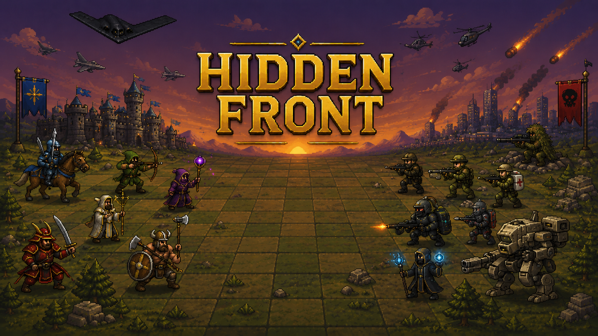

<div align="center">

# ⚔️ Hidden Front

**A turn-based tactical multiplayer game where eras collide on the battlefield.**


---



</div>

## 🎮 About the Game

**Hidden Front** is a turn-based tactical multiplayer game where players build their strategy using cards to equip units with weapons, gear, and unique abilities. Set on a battlefield where different eras and worlds collide, victory depends on planning, positioning, and outsmarting your opponent.

Imagine medieval knights clashing against modern soldiers, samurais facing off with mechs, and wizards casting spells beside snipers, all on the same grid-based battlefield. Each match is a strategic puzzle where every card played and every move made can shift the tide of war.

### ✨ Key Features

- [x] **🃏 Card-Based Strategy**: Build your deck, equip your units with weapons and gear, and unleash unique abilities through a tactical card system.
- [x] **⚔️ Cross-Era Warfare**: Command units from different historical eras and fictional worlds on a single battlefield.
- [x] **🧩 Grid-Based Tactics**: Position your units on a tile-based map where terrain, range, and line of sight shape every decision.
- [x] **🎯 Turn-Based Combat**: Plan your moves carefully; every turn counts when you're outmaneuvering your opponent.
- [x] **👥 Multiplayer Matches**: Go head-to-head with other players in tactical duels.
- [x] **🌍 Multi-language Support**: Play in English or Portuguese, with auto-detection of the system language. Configurations are automatically saved in `data/config.txt`.
- [x] **🎨 Retro Pixel Art**: A beautiful pixel art aesthetic inspired by classic strategy games, with smooth animations and rich visual feedback.

---

## 🛠️ Tech Stack

This project is built from the ground up in **C** using the **Allegro 5** multimedia library, focusing on performance, modularity, and low-level control.

| Technology | Purpose |
|:---:|:---|
|  | Core language — all game logic, systems, and engine code |
|  | Graphics rendering, input handling, audio, and fonts |
|  | Compiler toolchain for building the project |
|  | Primary target platform |

### Allegro 5 Modules Used

| Module | Description |
|:---|:---|
| `allegro_image` | Image loading and rendering (PNG, BMP, etc.) |
| `allegro_font` / `allegro_ttf` | Font rendering with TrueType support |
| `allegro_primitives` | Drawing shapes, lines, and geometric primitives |
| `allegro_audio` / `allegro_acodec` | Sound effects and background music playback |
| `allegro_dialog` | Native dialog boxes for system messages |

---

## 🏗️ Architecture

The project follows a **feature-based architecture** where each module has a single responsibility. Source (`.c`) and header (`.h`) files live together within their respective modules.

```
Hidden-Front/
├── 📂 assets/
│   ├── fonts/              # Pixelify Sans font family (.ttf)
│   └── images/
│       └── background/     # Background and banner artwork
│
├── 📂 src/
│   ├── core/               # Engine init, font manager, color system, input
│   ├── game/               # Game context, scene manager, app state
│   ├── scenes/             # Welcome, home, and fallback screens
│   ├── ui/                 # Reusable UI components (buttons, etc.)
│   ├── utils/              # Shared utilities (collision detection, etc.)
│   └── main.c              # Application entry point
│
├── 📂 docs/                # Architecture and design documentation
├── 📂 scripts/             # Build automation (compiler.bat)
└── 📂 bin/                 # Compiled output and Allegro runtime
```

<div align="center">

**⚔️ Plan. Position. Outsmart. ⚔️**

[](https://github.com/PedroFnseca)

</div>
